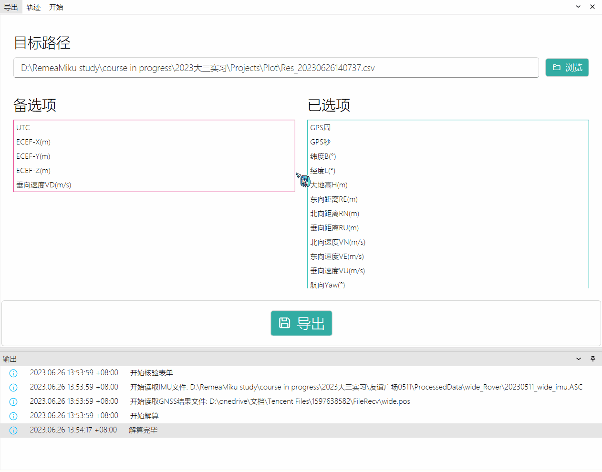

# LXIntegratedNavigation
## 项目简介
这是2023年武汉大学导航工程大三下学期综合实习的 .NET 7项目，大概花了1个半月完成，包含名为 [LXIntegratedNavigation.Shared](https://github.com/RemeaMiku/LXIntegratedNavigation/tree/master/LXIntegratedNavigation.Shared) 控制台程序和名为 [LXIntegratedNavigation.WPF](https://github.com/RemeaMiku/LXIntegratedNavigation/tree/master/LXIntegratedNavigation.WPF) 的程序。均依赖于另一个自编工具库 [NaviSharp](https://github.com/RemeaMiku/NaviSharp)。其中 WPF 程序使用了 MVVM 社区工具包、微软依赖注入扩展、WPF UI、Syncfusion WPF、gong-wpf-dragdrop 和 WpfMath 等 Nuget 包。
## LXIntegratedNavigation.Shared
LXIntegratedNavigation.Shared 是实现纯惯导机械编排和GNSS/INS松组合核心算法的.NET 7控制台程序。之所以单独创建此项目是为了将UI框架和算法解耦，使得算法项目不特定于UI框架，为以后代码重用提供便利。

Essentials目录即核心算法部分。Navigation目录下的 ` InertialNavigation ` 即惯性导航解算类，包含静态粗对准和机械编排算法； ` LooseCombination ` 即GNSS/INS松组合解算部分类，LooseCombination.cs包含常规松组合卡尔曼滤波更新算法而LooseCombination.Zupt.cs包含的是零速更新的部分； ` LooseCombinationOption ` 即解算配置类，包含IMU误差模型和初始误差等配置。NormalGravityModel下包含 ` INormalGravityModel ` 接口和实现了此接口的 ` Grs80NormalGravityModel ` GRS80正常重力模型类，获取输入纬度和高程处的正常重力。使用接口是为了方便实现DI。

Filters目录包含 ` KalmanFilter ` 卡尔曼滤波类，实现卡尔曼滤波一步预测和量测更新。

Helpers目录包含一些辅助性工具类。 ` BuildHelper ` 中包含角速度向量构造和IMU数据内插方法； ` FileHelper ` 中包含ASC格式的IMU数据文件和PosMind导出的GNSS数据文件的读取方法。

Models目录包含一些数据结构。 ` ImuData ` 存放IMU原始数据，包含GPS时间戳、采样间隔、三轴加速度计和陀螺仪输出等； ` GnssData ` 存放GNSS定位结果数据，包含GPS时间戳、位置和速度以及精度信息； ` NaviPose ` 存放导航位姿，包含GPS时间戳、位置、速度和姿态； ` ImuErrorModel ` 定义IMU误差模型，包含IMU名称、速度随机游走（VRW）、角度随机游走（ARW）、加速度计陀螺仪随机游走标准差和相关时间等。
## LXIntegratedNavigation.WPF
LXIntegratedNavigation.WPF是在引用LXIntegratedNavigation.Shared项目的基础上进行可视化显示的.NET 7 WPF项目（如果你不知道什么是WPF，请点击这里查看 [.NET WPF文档](https://learn.microsoft.com/zh-cn/dotnet/desktop/wpf/?view=netdesktop-7.0) ）。这个项目本身不实现任何导航算法，只是对LXIntegratedNavigation.Shared中的算法进行了进一步包装（使用MVVM架构，但其实由于时间原因实现的并不规范，还有很多问题。如果你不知道MVVM，请点击这里查看 [模型-视图-视图模型](https://learn.microsoft.com/zh-cn/dotnet/architecture/maui/mvvm)），以便于实现UI和数据交互。同时还使用了IoC设计理念。

Images目录下存放图片资源，包含一张背景图资源文件。之所以没有把资源统一打包进exe可执行文件中，是因为这样可以让背景图可随时被替换，只需要保证将文件名改为background.png即可。

Models目录包含一些数据结构，也正是MVVM中的Model（模型）层。 ` Log ` 存放输出窗口的日志信息； ` LogType ` 枚举类存放日志的类型，包含 ` Info ` 、 ` Warning ` 和 ` Error ` 三种； ` NavigationData ` 存放一次GNSS/INS松组合解算所需要和产生的所有数据，包括IMU加速度计陀螺仪、GNSS定位定速数据和解算得到的位姿等。

Services目录包含本WPF程序所提供的所有功能服务。 ` DataService ` 提供数据服务，封装了IMU和GNSS数据文件读取和解算结果数据导出的标记异步（ ` async ` ）方法和对应数据等。 ` async ` 方法的返回类型是 ` Task ` 或 ` Task<T> ` ，它可以使IO或大量计算等CPU高占用操作不会阻塞调用者的线程，在此WPF程序中即不会因为文件读写和解算等操作而产生UI界面卡死现象。 ` LogService ` 提供日志发送服务，通过调用 ` ILogReceiver ` 中的 ` void Receive(Log) ` 方法完成。其实.NET 7框架有自带的日志服务可使用，此处以简单易用目的考虑自己实现了一个简单日志服务。 ` NavigationService ` 提供导航服务，封装了GNSS/INS的松组合解算的异步方法。

Styles目录包含一些自定义XAML控件样式。

ViewModels目录包含页面的视图模型，也正是MVVM中的ViewModel（视图模型）层。一个页面与其视图模型一一对应。通过数据绑定 ` Binding ` 和命令 ` RelayCommand ` 实现，并通过调用依赖注入的服务（Service）来实现 ` View ` 和 ` Model ` 的交互。

Views目录包含所有视图的XAML布局文件及其代码隐藏，也正是MVVM中的View（视图）层，每一个视图都继承于 ` UserControl ` 类。在这里每一个视图都包含于 ` MainWindow ` 中的 ` DockManager ` 的子控件中，可自由缩放、贴靠、隐藏等。 ` StartPage ` 是开始页面，用于输入和验证（Validation）解算所需的所有配置参数，包括IMU和GNSS文件路径、IMU误差模型、惯导初始误差等参数。输入完成并且验证通过后将开始解算。解算完成后可跳转到 ` TrajectoryPage ` 轨迹展示页面。此页面展示解算得到的平面轨迹和运动动画，以初始位置为原点绘制。 ` FileExportPage ` 用于解算结果文件导出，可任意指定导航参数的导出项和顺序。

 ` App ` 即整个WPF应用程序类，继承于 ` Application ` 。App.xaml文件用于注册用到的资源字典（Resource Dictionary），以便于在其他XAML标记文件中引用，达到样式与结构分离的效果。App.xaml.cs是其代码隐藏， ` void OnStartUp(StartupEventArgs) ` 是应用程序启动时调用的方法，可重写以实现自己的代码逻辑。

 ` MainWindow ` 即WPF的主窗口，是程序所有控件最外层的结构，继承于 ` Window ` 类。MainWindow.xaml标记文件用于定义窗体样式和布局，MainWindow.xaml.cs是其代码隐藏。
## 界面与功能展示
### 解算参数配置与验证
打开折叠选项卡填写表单

在焦点改变时会对表单内容进行检查，若存在错误会弹窗提示并输出错误信息

### 运动轨迹回放
点击轨迹页播放按钮，将以约10倍速回放运动轨迹，当前位置将用红色圆点高亮显示，右侧同步显示速度仪表盘和指南针

### 图表创建与交互
轨迹图可自由移动、缩放并且可选择数据点，在属性窗口查看数据点解算信息。下方的下拉框可选择项目，点击“创建图表”按钮可绘制选择项的时序图。通过窗口拖拽与缩放可实现同时查看多个图表。这些图表和轨迹图一样，均可以自由交互和选点

### 导出项选择和拖拽
结果文件导出可通过拖拽来自由选择导出项和导出项的顺序。目前还不支持修改导出项格式
